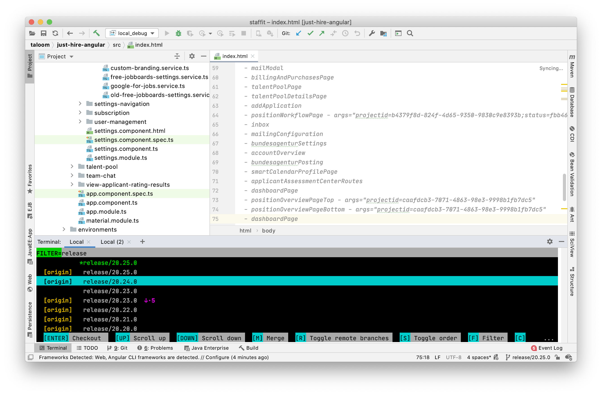

# git-toolbox

This repository contains a bunch of more sophisticated versions of common git command line tools.

## Prerequireties

In order do install or run this tool make sure either PIP or Anaconda is installed and available on your bash.


## Install

The repository's root directory contains a bash script for installation.

`bash install.sh`

#### Caution

Some packages will be installed during the installation. If anaconda is available a seperate environment will be created. If Anaconda is not found PIP will be used instead. This could lead to overwriting existing packages or versions. The usage of Anaconda is highly recommended. You can get it [here](https://www.anaconda.com/).

## git-stage

This tool implements an interactive and more sophisticated version of git-status.


### Run

After installation _git-stage_ is available in your bash using the following command:

`stage [PATH]`

If no path is provided the current directory will be used.

## git-branches

This tool implements an interactive way of managing your local and remote branches.



### Run

After installation git-branches is available in your bash using the following command:

``branches [-h] [-k] [PATH]``

If no path is provided the current directory will be used.

### -h

```
usage: branches [-h] [-k] [PATH]

Gives you an interactive overview of all branches

positional arguments:
  PATH             The path to the git repository that shall be used. If no path is provided the current working directory will be used.

optional arguments:
  -h, --help       show this help message and exit
  -k, --keep-open  The app stays open after checking out a branch
```

## git-commit

This tool implements more convenient way of commiting your staged changes by auto-generating prefilled commit messages and offering subsequent actions like bypassing hooks or pushing.

### Run

After installation git-commit is available in your bash using the following command:

``commit [-h] [-e] [-p] [-n]``

### -h

```
usage: commit [-h] [-e] [-p] [-n]

Runs git-commit with commit message that is prefilled with the ticket number.

optional arguments:
  -h, --help       show this help message and exit
  -e, --empty      Commit message will not be prefilled.
  -p, --push       After successful commit the current branch is immediately pushed to the default remote.
  -n, --no-verify  Verify hooks will be bypassed. This effects both commit and possible push hooks.
```